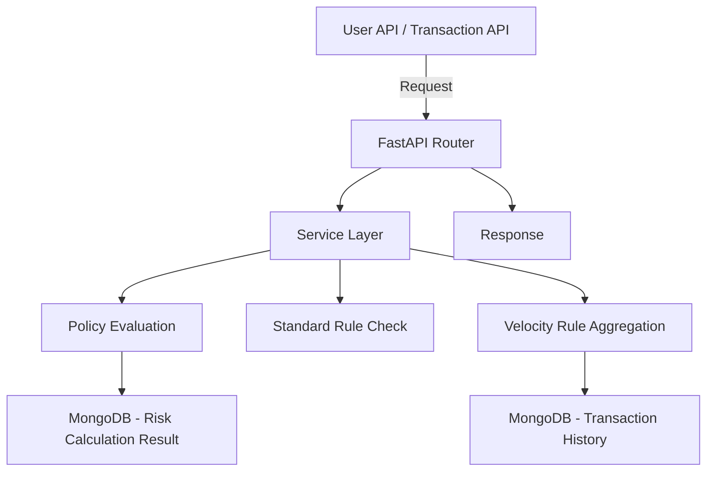

# Fraud Policy Engine - Documentation

## 📋 Project Overview
Fraud Policy Engine adalah aplikasi berbasis FastAPI yang bertugas melakukan evaluasi resiko transaksi menggunakan kombinasi **Standard Rules** dan **Velocity Rules**, memberikan **risk scoring**, serta melakukan klasifikasi otomatis menjadi **Normal**, **Suspect**, atau **Fraud**.

- **Backend**: FastAPI + MongoDB (Motor / Mongomock untuk testing)
- **Package Management**: Poetry
- **Testing**: Pytest + Mongomock
- **Deployment**: Dockerfile + Docker Compose
- **CI/CD**: GitHub Actions
- **Code Quality**: Pre-commit hooks (Black + Flake8)

---

## 🚀 Features
- CRUD User
- CRUD Transaction
- CRUD Policy (berisi kumpulan Rules)
- CRUD Standard Rule dan Velocity Rule
- Process transaction untuk evaluasi fraud
- Statistik user dan transaksi
- Statistik performa policy dan rule
- Auto Risk Classification
- Unit Test with Mongomock (tanpa butuh MongoDB server)
- Coverage report ready
- CI/CD ready

---

## 📁 Project Structure
```
app/
  api/              # API routers
  services/         # Business logic
  models/           # Pydantic models
  db/               # MongoDB connection (Motor)
  core/             # Config loader
  seeder/           # Seeder scripts for production & testing
  utils/            # (Optional utilities)

docker-compose.yml  # MongoDB + FastAPI
Dockerfile          # FastAPI production server
Makefile            # Make commands (run, test, test-cov, seed)
pyproject.toml      # Poetry config
.github/workflows/  # GitHub Actions CI
.pre-commit-config.yaml  # Pre-commit hooks
.env                # Environment variables
```

---

## ⚙️ How to Run

### 1. Development (local)
```bash
# Install dependencies
poetry install

# Run FastAPI app
make run

# Run Unit Tests
make test

# Run Coverage Tests
make test-cov

# Seed Production Data
make seed
```

### 2. Production (Docker)
```bash
# Build and run with docker-compose
docker-compose up --build
```

**Docker-compose akan otomatis menjalankan:**
- MongoDB
- FastAPI Server
- Auto seeding production data

#### Contoh docker-compose.yml
```yaml
version: '3.9'
services:
  mongo:
    image: mongo:5.0
    container_name: mongo
    ports:
      - 27017:27017
    volumes:
      - ./data/mongo:/data/db

  fraud_engine:
    build:
      context: .
      dockerfile: Dockerfile
      args:
        PROJECT_NAME: rules_policy_engine
        PROJECT_VERSION: 0.1.0
        COMMON_VERSION: 0.1.0
    ports:
      - 8000:8000
    depends_on:
      - mongo
    env_file:
      - .env
    volumes:
      - .:/app
```

### 3. Testing (Docker)
Jika ingin testing di CI/CD:
```bash
# Simulasi test dengan mongomock
USE_MOCK=true poetry run pytest
```

---

## 📖 API Endpoints

- `/api/v1/user/` → CRUD User
- `/api/v1/transaction/` → CRUD Transaction
- `/api/v1/policy/` → CRUD Policy
- `/api/v1/rule/standard` → CRUD Standard Rule
- `/api/v1/rule/velocity` → CRUD Velocity Rule
- `/api/v1/process/transaction` → Evaluate Transaction Risk
- `/api/v1/stats/` → User and Transaction Statistics
- `/api/v1/stats/policies-performance` → Statistik performa setiap policy
- `/api/v1/stats/rules-performance` → Statistik performa setiap rule

---

## 🛢️ Database (MongoDB Collections)

| Collection | Description |
|:-----------|:------------|
| users | User Information |
| transactions | User Transactions |
| policies | Fraud Policies |
| rules | Standard and Velocity Rules |
| fraud_data | Fraud Metadata (optional) |

---

## 🌐 Environment Variables (.env)
```dotenv
MONGO_URI=mongodb://mongo:27017
MONGO_DB_NAME=fraud_detection
USE_MOCK=false
```

Untuk unittest, gunakan `USE_MOCK=true`

---

## 📈 GitHub Actions - CI/CD

`.github/workflows/ci.yml` akan otomatis menjalankan:
- Install dependencies
- Run Pytest
- Generate coverage report

Setiap **push** atau **pull request** ke branch `main` akan otomatis dites.

---

## ✨ Pre-commit Hooks

Pre-commit akan otomatis:
- Auto-format kode (`black`)
- Cek coding standard (`flake8`)
- Hapus trailing whitespaces, fix EOL

Cara install:
```bash
poetry run pre-commit install
```

---

# 🗺️ Mini Diagram Arsitektur



**Penjelasan:**
- User atau Transaction masuk dari API
- Router mengarahkan ke Service Layer
- Service layer melakukan pengecekan Policy, Standard Rule, Velocity Rule
- Jika Velocity Rule, akan lakukan aggregation ke transaksi histori
- Hasil evaluasi dikalkulasi risk score dan disimpan kembali
- API memberikan response risk score dan status
- Statistik performa policy dan rule dihitung dari matched transactions

---

# ✅ Status
- Core System ✅
- Seeding Production ✅
- Seeding Testing ✅
- MongoMock for Test ✅
- Full API & Service Layer ✅
- Statistik Policy dan Rule ✅
- Unit Testing Full ✅
- GitHub Actions ✅
- Coverage ✅
- Pre-commit Hook ✅
- Dockerfile & Docker Compose ✅

---

# ✨ Selesai! 🚀

Kalau butuh tambahan: contoh Swagger JSON, OpenAPI docs customization, atau RAG (Retrieve and Generate) docs, tinggal lanjut saja! 🔥

---

_Enjoy building your Fraud Detection Platform!_ 🚀🔥
