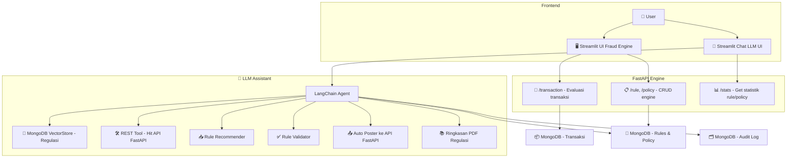
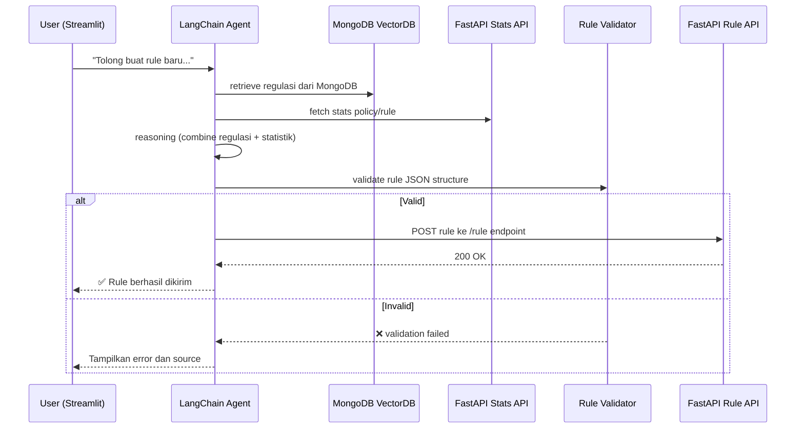
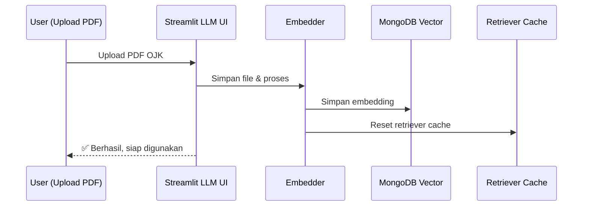

# 🛡️ Fraud Detection Engine + LLM Assistant – Full Documentation

---

## 📌 Overview

Sistem ini adalah platform modular berbasis FastAPI, MongoDB, Streamlit, dan LLM (GPT/Gemini/Ollama) untuk:

- 🚦 Menilai risiko transaksi secara otomatis
- ⚙️ Mengelola rule engine berbasis policy, standard, dan velocity rule
- 🧠 Mengintegrasikan LLM untuk membaca regulasi OJK/BI dan menyarankan struktur rule/policy
- 📊 Melakukan analisis performa fraud rule/policy
- 💬 Menyediakan antarmuka Streamlit untuk eksplorasi dan interaksi AI

---

## 📂 Struktur Proyek

```
fraud_detection_engine/
├── app/                     # FastAPI core (user, transaction, rule, policy, processing)
├── llm_module/              # Modul embedding, retriever, summarizer, agent, validation
├── streamlit_llm_ui/        # Chat-based Streamlit UI
├── Dockerfile               # Untuk fraud_engine
├── Dockerfile.llm_chat      # Untuk llm_chat_ui
├── Dockerfile.llm_embedder  # Untuk llm_module/main.py
├── docker-compose.yml
├── .env
└── README.md
```

---

## 📈 Mermaid Diagram – Arsitektur Umum Fraud Detection Engine + LLM



---

## 🛠️ Penjelasan Teknis – Implementasi LLM

### 1. RAG (Retrieval-Augmented Generation)
- Load dokumen regulasi PDF
- Embedding via OpenAI atau HuggingFace
- Disimpan ke MongoDB Vector Store
- Digunakan retriever untuk query berbasis konteks

### 2. LangChain Agent
- Menggunakan tools:
  - REST API Tool (fetch stats)
  - Rule JSON builder
  - Poster rule
- Dapat menggunakan OpenAI, Ollama, atau Gemini
- Memory support untuk multi-turn chat

### 3. Validasi dan Poster
- Hasil ekstraksi divalidasi menggunakan `rule_schema_validator`
- Jika valid → dikirim ke API `/rule/standard` atau `/rule/velocity`
- Jika tidak → ditampilkan sebagai error

### 4. Audit Trail
- Semua interaksi agent, upload, dan ekstraksi dicatat di collection MongoDB `audit_trail`

---

## 📘 Mermaid – Alur Agent Reasoning untuk Rule Rekomendasi



---

## 🔄 Alur Upload Regulasi dan Auto-Retriever Reload



---

## 🧪 API Endpoint Overview

| Endpoint | Method | Keterangan |
|----------|--------|------------|
| `/api/v1/user/` | GET/POST | Manajemen user |
| `/api/v1/transaction/` | POST/GET | Transaksi baru & daftar |
| `/api/v1/policy/` | POST/GET | Policy baru & daftar |
| `/api/v1/rule/standard` | POST/GET | Rule standard |
| `/api/v1/rule/velocity` | POST/GET | Rule velocity |
| `/api/v1/process/transaction` | POST | Evaluasi transaksi |
| `/api/v1/stats/...` | GET | Statistik rule/policy/transaksi |

---

## 🔧 Konfigurasi `.env`

```dotenv
MONGO_URI=mongodb://mongo:27017
MONGO_DB_NAME=fraud_detection
LLM_PROVIDER=ollama
OLLAMA_MODEL=deepseek-8b-instruct
OLLAMA_BASE_URL=http://localhost:11434
OPENAI_API_KEY=your-openai-key
GOOGLE_API_KEY=your-google-api-key
```

---

## 🛠️ Teknologi

- FastAPI
- MongoDB
- Streamlit
- LangChain
- Ollama / OpenAI / Gemini
- Docker + Poetry

---

## ✅ Status

| Komponen | Status |
|----------|--------|
| FastAPI Fraud Engine | ✅ |
| LLM Chat UI | ✅ |
| LangChain Agent | ✅ |
| Embedder + Retriever | ✅ |
| Auto retriever refresh | ✅ |
| Audit Log | ✅ |
| Rule Extractor + Validator | ✅ |
