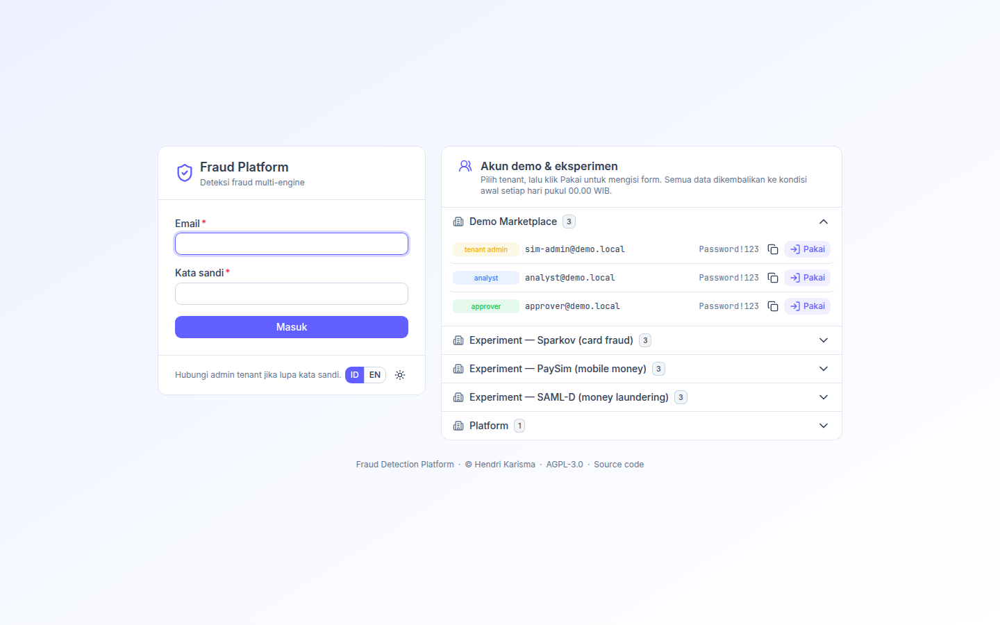
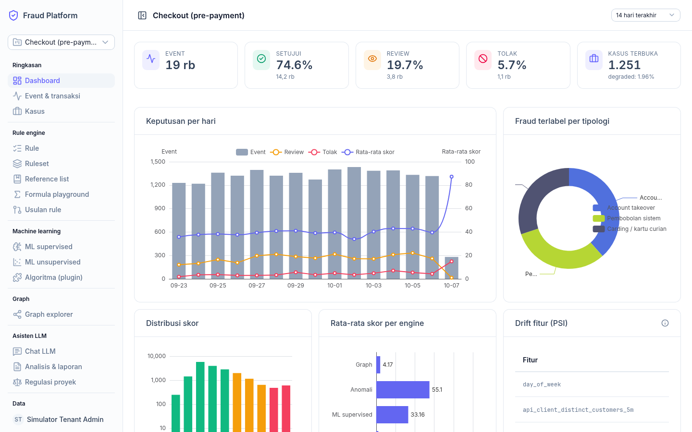
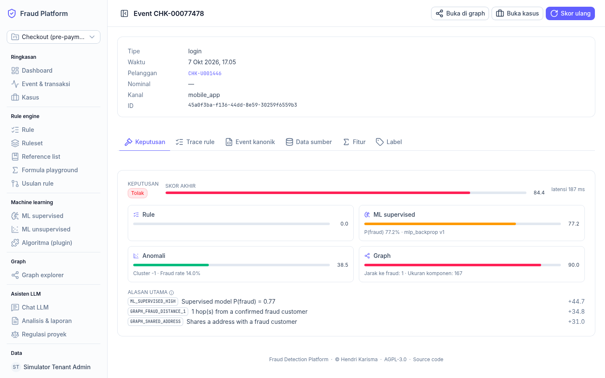
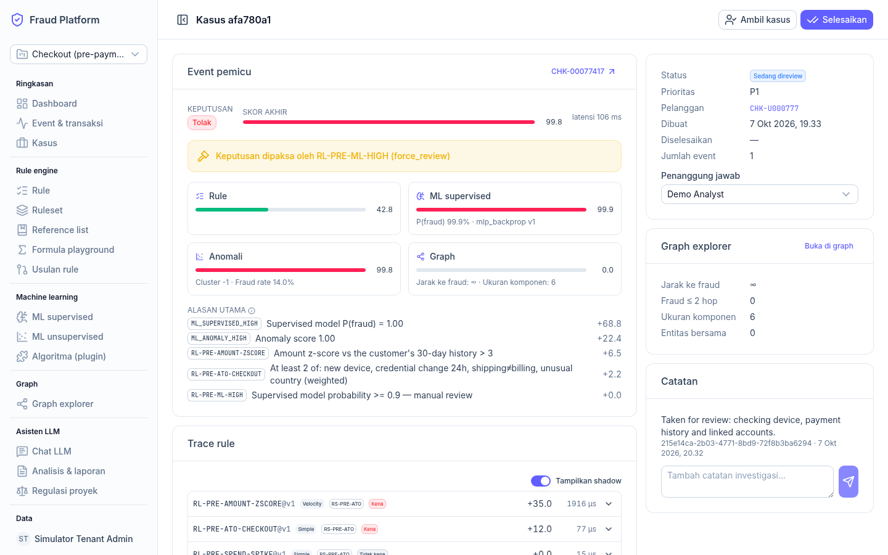
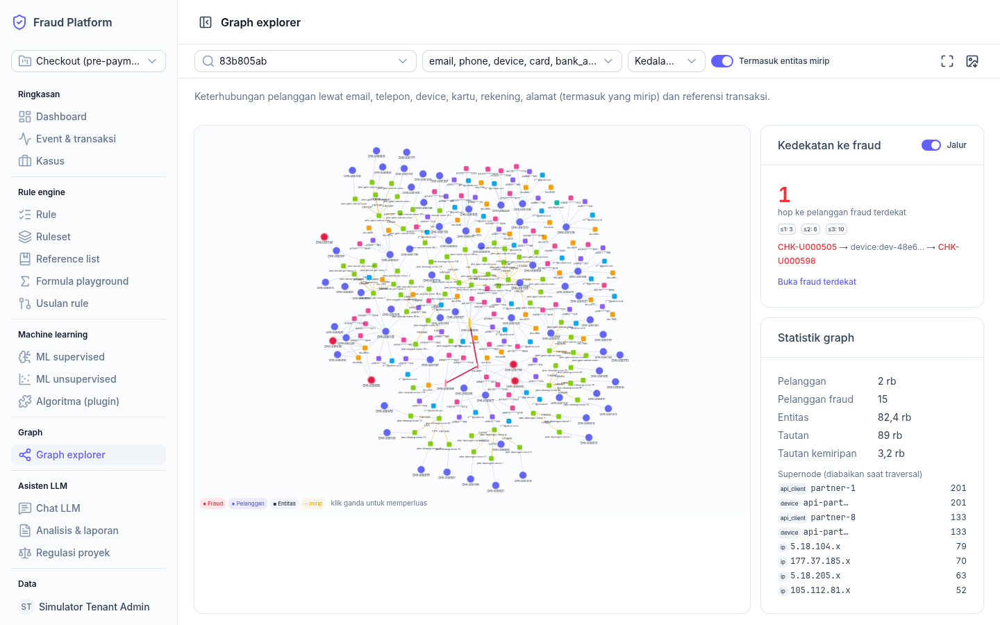
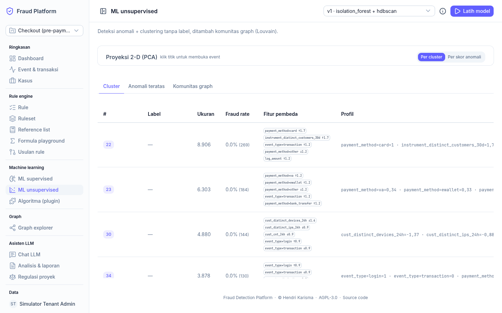
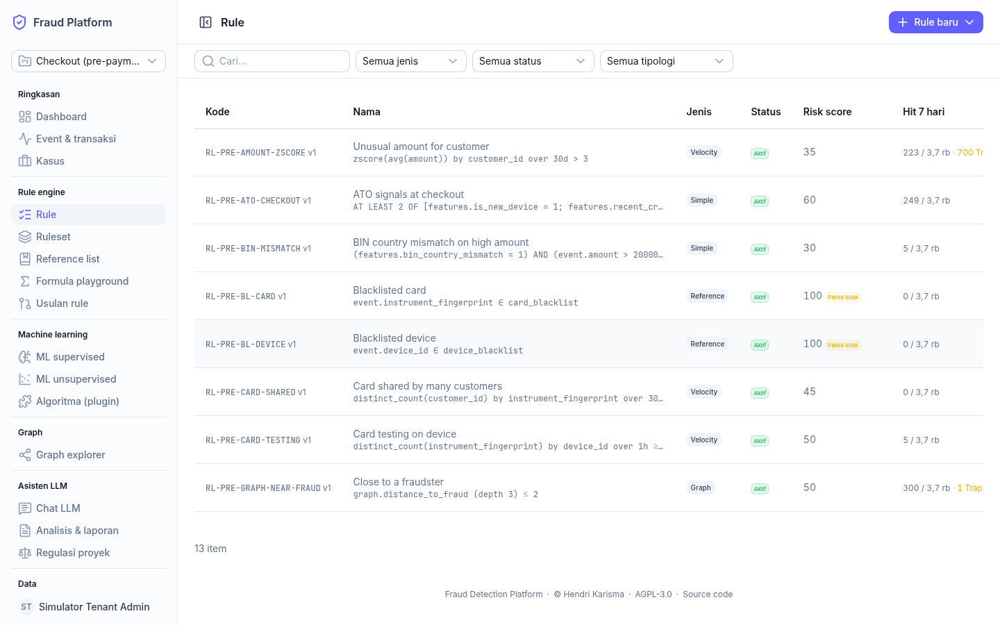
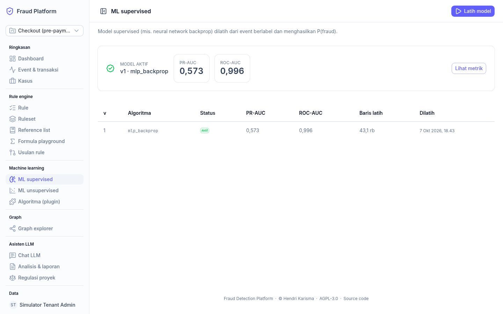
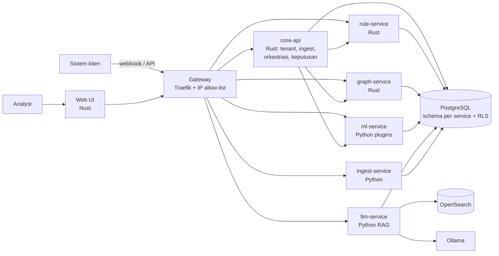

# Fraud Detection Platform

Platform deteksi fraud **multi-tenant** dengan lima engine yang saling melengkapi: **Rule engine**, **Supervised ML**,
**Unsupervised ML (anomaly & clustering)**, **Graph**, dan **LLM assistant** untuk regulasi. Dibangun dengan Rust,
Python, PostgreSQL, OpenSearch, Ollama, dan Nuxt; dijalankan dengan satu `docker compose up`.

> Dokumen ini gambaran besar. Semua detail ada di [`docs/`](docs/).

---

## Fitur utama

| Engine | Kemampuan |
|---|---|
| **Rule engine** (Rust) | 5 jenis rule: *simple* (bandingkan field dengan nilai **atau field lain**), *velocity* (agregasi + group by + window, termasuk statistik: z-score, gaussian, regresi linear, poisson), *composite* (velocity dengan filter histori), *reference* (white/black-list, dibuat saat runtime), *graph*. Operand bisa berupa formula seperti `F(x,y,z) = 2x + 2^y / z^2`. Hasil tiga nilai: match / no_match / **trapped**. Ruleset berbobot, versioning, shadow mode, backtest. |
| **Supervised ML** (Python) | Plugin algoritma yang bisa ditambah tanpa rebuild. Bawaan: MLP backpropagation (PyTorch), logistic regression, gradient boosting, random forest. Label maturity, split berbasis waktu, penjelasan per prediksi. |
| **Unsupervised ML** (Python) | Anomaly (isolation forest, LOF, autoencoder) + clustering (HDBSCAN, k-means, DBSCAN, GMM), profil cluster, proyeksi 2-D, komunitas graph (Louvain). |
| **Graph** (Rust) | Relasi antar pelanggan lewat email, HP, device, IP, kartu, rekening, alamat, ref transaksi, termasuk yang **mirip** (HP beda 1 digit, alamat mirip). Jarak ke fraudster, komponen, proteksi supernode. |
| **LLM assistant** (Python + Ollama) | Library regulasi/kebijakan (OJK, BI, SOP), RAG hybrid di OpenSearch, deteksi perubahan regulasi per pasal, analisis relevansi rule, kondisi fraud terkini, dan **usulan** rule (tidak pernah aktif otomatis). |

Kemampuan platform:

* **Multi-tenant, multi-project:** satu perusahaan bisa punya banyak project (mis. *pre-payment*, *post-payment*,
  *returns*, *promo*), masing-masing dengan rule, model, graph, dan regulasinya sendiri. Isolasi data dijamin oleh
  PostgreSQL Row-Level Security.
* **Data sendiri tanpa ubah kode:** hubungkan file, database, atau webhook dengan struktur apa pun. Sistem
  menyarankan mapping (termasuk nama kolom berbahasa Indonesia), dan semua kolom langsung bisa dipakai di rule dan
  model.
* **Governance:** maker–checker (empat mata), audit log yang tidak bisa diubah, alasan keputusan yang bisa
  dijelaskan, dan PII (kartu/rekening) di-hash.
* **Tipologi fraud:** carding, account takeover, pengambilalihan rekening, sistem dibobol, abuse promo/voucher/cashback,
  abuse retur, money mule.

## Tampilan

Demo publik: **https://fds.hendrikarisma.my.id** (akun tercantum di halaman login; data kembali ke kondisi awal setiap 00.00 WIB).

| | |
|---|---|
|  |  |
| Login: akun demo & eksperimen per tenant | Dashboard project: keputusan, distribusi skor, skor per engine, drift |
|  |  |
| Detail event: skor 4 engine, alasan, latensi | Case: event pemicu, trace rule, catatan investigasi |
|  |  |
| Graph explorer: jalur ke pelanggan fraud terdekat | ML unsupervised: anomali & cluster (PCA) |
|  |  |
| Rule engine: rule berversi, maker–checker, shadow | ML supervised: model registry & metrik |

Screenshot lain: [`docs/images/screenshots/`](docs/images/screenshots/).

---

## Arsitektur singkat


```mermaid
flowchart LR
    U[Analyst] --> W[Web UI<br/>Nuxt]
    C[Sistem klien] -->|webhook / API| G
    W --> G[Gateway<br/>Traefik + IP allow-list]
    G --> CORE[core-api<br/>Rust: tenant, ingest,<br/>orkestrasi, keputusan]
    G --> RULE[rule-service<br/>Rust]
    G --> GRAPH[graph-service<br/>Rust]
    G --> ML[ml-service<br/>Python plugins]
    G --> LLM[llm-service<br/>Python RAG]
    G --> ING[ingest-service<br/>Python]
    CORE --> RULE & GRAPH & ML
    LLM --> OS[(OpenSearch)] & OL[Ollama]
    CORE & RULE & GRAPH & ML & LLM & ING --> PG[(PostgreSQL<br/>schema per service + RLS)]
```

Setiap event melewati: mapping → graph → fitur → ML → rules → kombinasi skor (noisy-OR) → keputusan
**approve / review / decline** + alasan. Detail: [`docs/technical/architecture.md`](docs/technical/architecture.md).

## Quick start

Kebutuhan: Docker + Docker Compose, RAM ± 16 GB (Ollama + OpenSearch), disk ± 20 GB.

```bash
cp .env.example .env              # lalu ganti semua nilai CHANGE_ME
docker compose up -d --build      # build & jalankan semua service
docker compose up ollama-pull     # unduh model LLM (sekali saja, ± 6 GB)
docker compose --profile seed run --rm simulator   # opsional: data demo
```

| Akses | Default |
|---|---|
| Web UI | `http://<host>:3000` (`WEB_HOST_PORT`) |
| API gateway | `http://<host>:8080/api/v1` (`GATEWAY_HOST_PORT`) |
| OpenAPI per service | `http://<host>:8080/api/openapi/{core,rule,graph,ml,llm,ingest}.json` |

Hanya jaringan di `ALLOWED_SOURCE_RANGES` (default `10.100.21.0/24`, `192.168.1.0/24`) yang bisa mengakses UI dan
API. Login pertama memakai `ADMIN_EMAIL` / `ADMIN_PASSWORD` dari `.env`.

Panduan lengkap: [Quickstart](docs/guides/quickstart.md) · [Deployment](docs/guides/deployment.md).

## Dokumentasi

| Untuk | Dokumen |
|---|---|
| Bisnis / manajemen | [Ringkasan non-teknis](docs/business/overview.md) |
| Pengguna (analis) | [Panduan pengguna per engine](docs/guides/user-guide.md) |
| Developer | [Panduan developer](docs/guides/developer-guide.md) · [Kenapa struktur Rust-nya begini (untuk developer Java)](docs/technical/rust-codebase-guide.md) |
| Operasional | [Deployment & operasional](docs/guides/deployment.md) |
| Riset | [Panduan eksperimen (demo & dataset publik, master snapshot)](docs/guides/experiments.md) |
| Teknologi & metode | [Technical overview: tech stack, arsitektur software & AI, metode/sains](docs/technical/technical-overview.md) |
| Kontrak teknis | [Arsitektur](docs/technical/architecture.md) · [Multi-tenancy](docs/technical/multi-tenancy.md) · [Rule DSL](docs/technical/rule-dsl.md) · [Data source](docs/technical/data-sources.md) · [Feature catalog](docs/technical/feature-catalog.md) · [ML plugins](docs/technical/ml-plugins.md) · [API](docs/technical/api-contract.md) |
| Kualitas | [Dataset riset harian (demo live)](docs/technical/research-dataset.md) · [Evaluasi deteksi end-to-end](docs/technical/evaluation.md) · [Gap analysis](docs/technical/gap-analysis.md) |
| Rencana | [Backlog](docs/backlog.md) |

## Struktur repository

```
services/rust/        core-api, rule-service, graph-service + crate platform, contracts, rule-engine
services/python/      ml-service, llm-service, ingest-service
web/                  Nuxt UI
db/migrations/        skema PostgreSQL (satu sumber kebenaran) + db/tests
deploy/               init Postgres, konfigurasi gateway
plugins/              plugin algoritma ML eksternal (hot reload)
tools/simulator/      generator data sintetis + evaluasi
docs/                 dokumentasi teknis, bisnis, panduan, backlog
legacy/               kode versi awal (FastAPI + MongoDB), history lengkap di branch legacy/python-fastapi-mongo
```

## Lisensi

Hak cipta © 2025–2026 **Hendri Karisma**. Dirilis di bawah **GNU Affero General Public License v3.0 only**
([LICENSE](LICENSE)) dengan ketentuan tambahan atribusi sesuai pasal 7(b) ([NOTICE](NOTICE)):

* Siapa pun boleh memakai, mempelajari, menjalankan, dan memodifikasi software ini, termasuk sebagai layanan online.
* Versi yang dimodifikasi **wajib tetap memakai lisensi yang sama**, dan source code-nya wajib tersedia bagi
  penggunanya.
* **Atribusi tidak boleh dihapus:** Hendri Karisma sebagai pembuat asli, serta semua kontributor sebelumnya
  ([AUTHORS](AUTHORS)), harus tetap dicantumkan.
