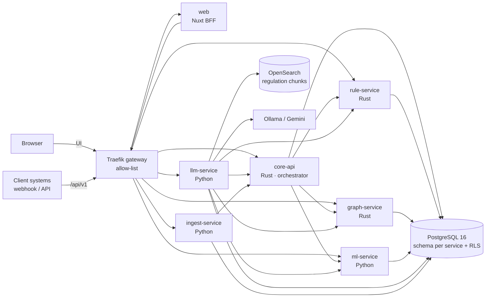
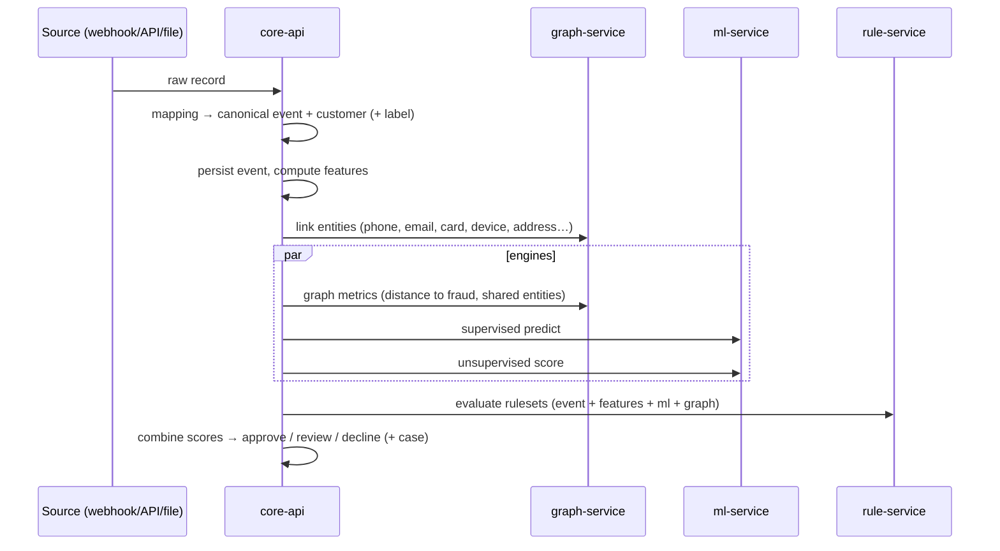
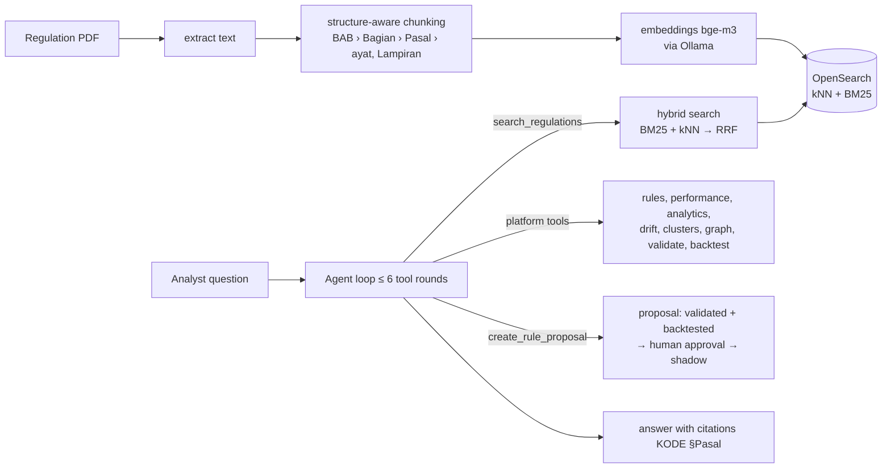

# Technical Overview — Tech Stack, Architecture, AI and Methods

One-document tour of the platform for engineers, reviewers and researchers. Details live in the linked documents:
[architecture](architecture.md) · [rule DSL](rule-dsl.md) · [ML plugins](ml-plugins.md) ·
[multi-tenancy](multi-tenancy.md) · [data sources](data-sources.md) · [evaluation](evaluation.md) ·
[API contract](api-contract.md). The non-technical summary is [business/overview.md](../business/overview.md).

---

## 1. Tech stack

| Layer | Technology | Version | Why |
|---|---|---|---|
| Gateway | Traefik | 3.1 | Path routing to services, IP allow-list, rate limits, body limits, security headers |
| Core services | Rust (`core-api`, `rule-service`, `graph-service`) | toolchain 1.96 (Docker), axum 0.8, tokio, sqlx 0.8 | Hot path of every scoring call: predictable latency, memory safety, one binary per service |
| Rule engine | Rust crate `rule-engine` | in-repo | Pure library (no I/O): formula parser, condition tree, statistics, aggregation; unit-tested in isolation |
| AI / ML services | Python 3.12, FastAPI, PyTorch ≥ 2.4, scikit-learn ≥ 1.5, pandas, networkx | — | ML ecosystem; only where models are trained or served |
| LLM service | Python, FastAPI, httpx, opensearch-py, pypdf | — | RAG + agent; no LangChain, so every prompt and call is explicit and auditable |
| Ingest service | Python, pandas | — | Schema inference and file/DB parsing (CSV, TSV, JSON/JSONL, Parquet, XLSX, Postgres/MySQL) |
| Database | PostgreSQL | 16.4 | System of record; row-level security per tenant; one schema + least-privilege role per service |
| Vector / search | OpenSearch | 2.19 | kNN (HNSW, Lucene engine) + BM25 over regulation chunks |
| LLM runtime | Ollama (0.12 image) or Gemini (OpenAI-compatible API) | — | Local/private by default; cloud chat optional |
| Web | Nuxt 4 + Nuxt UI 4, Pinia, vue-i18n (ID/EN), ECharts, Cytoscape, CodeMirror | Node ≥ 22.19 | UI per engine plus a BFF that keeps tokens server-side |
| Auth | JWT (HS256) access + refresh, Argon2 password hashes, sealed session cookie in the BFF | — | Browser never sees tokens |
| Packaging | Docker Compose (classic builder compatible), uv, cargo-chef | — | One command to run everything |
| CI | GitHub Actions: fmt/clippy/test (Rust), ruff/mypy/pytest (Python), eslint/typecheck/vitest/build (web), migrations + RLS smoke tests, image builds | — | Every service is gated |

## 2. Software architecture

### 2.1 Containers



Principles:

* **Database-per-service schema, shared cluster.** Each service owns its schema and connects with its own role; cross-service
  reads go through APIs or explicit read grants, never shared writes.
* **Multi-tenancy by construction.** Every row carries `tenant_id` (+ `project_id`); every transaction sets
  `app.tenant_id` and Postgres RLS filters rows. Composite foreign keys stop a row from pointing at another tenant's project.
* **Hexagonal services.** Rust services split `domain` (pure logic) / `app` (use cases) / `adapters` (HTTP, SQL);
  the rule engine is a separate pure crate.
* **Degraded, never lost.** An event is persisted before any engine is called; a failing engine is dropped from the
  decision and recorded in `decision.degraded`.
* **Governance everywhere.** Rules, rulesets and ML models are immutable versions with maker–checker approval and
  a shadow mode; every change goes to an append-only audit log.

### 2.2 Scoring pipeline (one event)



Time budgets (per project): graph 100 ms, ML 200 ms, rules 300 ms.

## 3. AI architecture

The platform combines **five detection engines** and one **LLM assistant**. No single model decides alone.

| Engine | Learns from | Strength | Weakness covered by others |
|---|---|---|---|
| Rules | analyst knowledge, regulations | explainable, immediate, enforce policy | cannot generalise to new patterns |
| Supervised ML | labelled history | high precision on known fraud types | blind to new typologies, needs labels |
| Unsupervised ML | unlabelled behaviour | finds new / rare patterns | noisy, not explainable alone |
| Graph | relationships between customers | rings, mules, shared devices/cards | weak for first-party, isolated fraud |
| LLM assistant | regulations + platform data | turns regulation and drift into rule proposals | never scores events; humans approve |

### 3.1 Decision fusion

Each engine yields a score `sᵢ ∈ [0,100]` with project weights `wᵢ` (default rules 0.45, supervised 0.30, unsupervised 0.10,
graph 0.15). The default fusion is a weighted **noisy-OR**:

```
final = 100 · (1 − Π (1 − sᵢ/100)^(wᵢ / w_max))
```

Independent evidence accumulates and a silent engine (s = 0) never dilutes a strong signal. `weighted_average` is
available as an alternative. Thresholds (default review ≥ 50, decline ≥ 80) and `force_*` rule actions produce the
decision; every decision carries up to 8 attributed reasons.

### 3.2 ML plugins

Algorithms are **plugins** discovered at runtime (hot reload, validation and smoke test before use). Training is per
project, with a time-based split, imbalance handling, and model registry + approval.

* Supervised: `mlp_backprop` (PyTorch), `logistic_regression`, `gradient_boosting`, `random_forest`.
* Anomaly: `isolation_forest`, `local_outlier_factor`, `autoencoder`, `knn_distance_anomaly`.
* Clustering: `hdbscan`, `kmeans`, `dbscan`, `gaussian_mixture`.
* Demo default: `mlp_backprop` + `isolation_forest`/`hdbscan` per project.

### 3.3 LLM assistant (RAG + tool-using agent)



* **Retrieval:** hybrid BM25 (exact legal terms) + kNN (semantic), fused with Reciprocal Rank Fusion, restricted to
  documents attached to the project; at least 4 chunks are always retrieved.
* **Agent:** native tool calling with 12 allow-listed tools; one write tool only (`create_rule_proposal`). Each tool has a
  timeout; integer arguments from the model are validated and clamped.
* **Guardrails:** prompts forbid inventing numbers or articles; proposals are schema-validated, auto-repaired, backtested
  on 30 days, and start as **pending** → approval → **shadow** before they can score.
* **Providers:** Ollama (local, private; `<think>` blocks of reasoning models are stripped) or Gemini for chat; embeddings
  stay local so the index never depends on the chat provider.

## 4. Methods and science

### 4.1 Rules

* **Tri-state logic:** `match` / `no_match` / `trapped` (evaluation error: division by zero, null, missing reference).
  Trapped outcomes are logged and can score or route to review.
* **Formula operands:** user-typed functions such as `F(x,y,z) = 2x + 2^y / z^2` (implicit multiplication, math and
  statistics functions).
* **Velocity statistics** over a customer's history:

| Function | Definition |
|---|---|
| z-score | `(x − μ) / σ` of the history |
| gaussian tail | `P(X ≥ x)` (or lower/two-sided) under `N(μ, σ)` |
| percentile rank | share of history ≤ x |
| linear trend | OLS over bucketed series → slope, forecast, residual z = `(actual − forecast)/σ_res` |
| poisson tail | `λ` = mean bucket count; `P(N ≥ current count)` |

* **Ruleset aggregation:** `sum`, `max`, `probabilistic_or` (`1 − Π(1 − pᵢ)`), `weighted_average`, capped by `max_score`.

### 4.2 Machine learning

* **MLP with backpropagation:** fully connected layers, ReLU, batch-norm, dropout; loss = binary cross-entropy with
  `pos_weight = N_neg / N_pos` (clamped to 1–1000) for class imbalance; Adam optimiser; early stopping on validation **PR-AUC** (more honest
  than ROC-AUC when fraud is rare). Explanation per prediction = gradient × input.
* **Isolation Forest:** anomaly score from the average path length to isolate a point in random trees
  (`s(x) = 2^(−E[h(x)] / c(n))`), min-max normalised on the training distribution.
* **HDBSCAN:** density-based hierarchical clustering. Points that belong to no cluster are noise (−1); per-cluster
  fraud rate and distinguishing features are profiled for analysts.
* **Validation:** time-based split (train on the past, test on the future) to avoid leakage; metrics ROC-AUC, PR-AUC,
  confusion matrix, calibration.
* **Drift:** Population Stability Index `PSI = Σ (aᵢ − eᵢ) · ln(aᵢ / eᵢ)` per feature between reference and recent windows.

### 4.3 Graph

* **Entity resolution:** customers are linked through shared phone, email, device, IP, address, card and bank account
  (exact, after normalisation; cards and bank accounts only as tenant-peppered HMAC fingerprints, never raw), and through similar phones/emails/addresses (PostgreSQL `pg_trgm` trigram
  similarity above a threshold).
* **Metrics:** BFS shortest distance to a known fraudster (score map `{1: 90, 2: 70, 3: 40}`), number of fraud neighbours,
  shared fraud entities, connected-component size.
* **Communities:** Louvain modularity optimisation (networkx); community fraud rate feeds graph rules.

### 4.4 Evaluation (synthetic, out-of-sample)

The simulator generates realistic typologies (carding, account takeover, system breach, account takeover of bank
accounts, money mules, return abuse, promo abuse). Results with the default threshold 50
([evaluation.md](evaluation.md)):

| Project | Recall | Precision | FPR | AUC final |
|---|---|---|---|---|
| checkout (pre-payment) | 95.2% | 40.0% | 7.4% | 0.986 |
| post-payment | 82.2% | 17.7% | 32.1% | 0.862 |
| returns | 100% | 13.7% | 34.7% | 0.998 |
| promo | 100% | 63.4% | 5.5% | 0.999 |

High AUC with low precision in post-payment/returns means the ranking is good but the threshold is too low; per-project
threshold recommendation is on the backlog.

## 5. Engineering practices

* **Testing:** unit tests per crate/package, Rust integration tests against a real Postgres 16 (with RLS and roles),
  Python tests with HTTP mocks, web unit tests, migration + RLS smoke tests, end-to-end simulation.
* **Security:** IP allow-list at the gateway, JWT with refresh, Argon2, RLS, least-privilege DB roles, no tokens in the
  browser, CSRF header on mutating BFF calls, audit log that cannot be updated or deleted, 64 KB header limit on the web.
* **Operations:** health/readiness endpoints, structured JSON logs with request ids, OpenAPI per service, demo reset
  script (`deploy/demo/reset-demo.sh`).

## 6. References

* Breiman, L. (2001). *Random Forests.* Machine Learning 45.
* Rumelhart, D., Hinton, G., Williams, R. (1986). *Learning representations by back-propagating errors.* Nature 323.
* Liu, F. T., Ting, K. M., Zhou, Z.-H. (2008). *Isolation Forest.* ICDM.
* Breunig, M. et al. (2000). *LOF: Identifying density-based local outliers.* SIGMOD.
* Campello, R., Moulavi, D., Sander, J. (2013). *Density-based clustering based on hierarchical density estimates (HDBSCAN).* PAKDD.
* Blondel, V. et al. (2008). *Fast unfolding of communities in large networks (Louvain).* J. Stat. Mech.
* Cormack, G., Clarke, C., Büttcher, S. (2009). *Reciprocal rank fusion outperforms Condorcet and individual rank learning methods.* SIGIR.
* Lewis, P. et al. (2020). *Retrieval-Augmented Generation for knowledge-intensive NLP tasks.* NeurIPS.
* Saito, T., Rehmsmeier, M. (2015). *The precision-recall plot is more informative than the ROC plot on imbalanced datasets.* PLOS ONE.
* Otoritas Jasa Keuangan (2024). *POJK No. 12 Tahun 2024 tentang Penerapan Strategi Anti Fraud bagi Lembaga Jasa Keuangan.*
